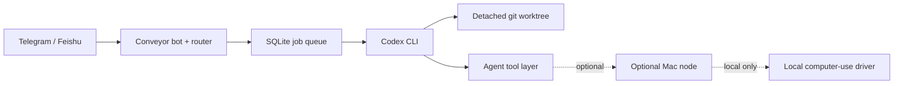

<div align="center">

# Conveyor

**Run Codex from Telegram or Feishu on your own VPS — with isolated worktrees, auditability, and optional Mac execution nodes.**

Self-hosted · Single-operator · Read-first · Explicit apply / discard controls

[中文文档](README.zh.md) · [Architecture](docs/architecture.en.md) · [Desktop security](docs/desktop_security.md) · [License](LICENSE)

</div>

> [!IMPORTANT]
> **v0.1.1 security-hardening upgrade:** after updating an existing VPS, reinstall/reload the narrowed systemd units and run `make smoke` before restarting services. See the deployment docs / previous long-form README in Git history for the exact upgrade sequence.

---

## The idea

You are away from your laptop. Your repo, logs, services, and Codex CLI are on a VPS or dev box.

Conveyor turns a private Telegram or Feishu chat into a control plane for that environment:

```text
Phone
  ↓
Telegram / Feishu
  ↓
Conveyor control plane
  ↓
Codex in an isolated git worktree
  ↓
status · diff · apply · discard · cancel
```

The goal is not to build another public chatbot. Conveyor is for **one trusted operator controlling their own developer environment**.

## Why it is different

A remote coding agent becomes useful only when you can answer four questions:

1. **Where did it run?** — in a detached worktree, not directly on your main checkout.
2. **What changed?** — inspect `/status` and `/diff` before anything lands.
3. **How do I stop it?** — `/cancel`, `/discard`, queue controls, and computer-use kill switches.
4. **What was allowed?** — explicit tool boundaries, audit logs, allowlists, and safety gates.

That control surface is the product.

## Core workflow

```text
/run fix the failing parser test
        ↓
acknowledge job + worktree
        ↓
Codex works asynchronously
        ↓
/status   /diff
        ↓
/apply  or  /discard
```

Conveyor also supports a persistent single-concurrency queue, so jobs survive bot restarts and VPS reboots instead of disappearing with the chat process.

## What it can do

- **Remote Codex jobs** — start, inspect, cancel, discard, and apply worktree-based tasks.
- **Persistent job queue** — SQLite-backed FIFO execution with pause/resume and restart recovery.
- **Telegram + Feishu** — the same control model across both chat surfaces; Feishu can render interactive action cards.
- **Developer ops** — load, process, disk, logs, services, git status, diagnostics, smoke checks, and maintenance commands.
- **Personal tools** — notes, reminders, memory, daily briefs, project profiles, and planning helpers.
- **Optional integrations** — Gmail, Google Calendar/Contacts, GitHub, files/knowledge base, and web research when configured.
- **Execution nodes** — keep the control plane on the VPS while an optional Mac node performs desktop-side work.
- **Direct computer use** — opt-in Codex → Cua → Mac actions with arming, limits, blocked targets, redacted logs, and a kill switch.

## Architecture



The VPS remains the control plane. Desktop computer-use actions are executed on the Mac node; the Cua protocol is not exposed over the network.

## Safety model

Conveyor intentionally assumes a **single trusted operator**, but still treats agent execution as something that needs boundaries.

For coding jobs:

- detached git worktrees
- exact sender allowlists
- explicit diff inspection
- apply / discard separation
- dangerous-action confirmation
- cancellation and queue controls
- audit logging for mutating tools

For direct computer use:

- feature disabled by default
- direct-mode gate + optional arm TTL
- action allowlist
- built-in blocked keywords and high-risk apps
- maximum steps / wall-clock limits
- redaction for typed text and hotkeys in stored logs
- `/computer_stop` kill switch

See [`docs/desktop_security.md`](docs/desktop_security.md) for the detailed model.

## Example commands

```text
/run fix the failing test and show me the diff
/status
/diff
/apply
/cancel

看看磁盘
为什么服务器这么慢
提醒我 10 分钟后看 build
```

Optional computer-use flow:

```text
/computer_status
/computer_arm 30
/computer_task 打开 Chrome 并访问指定页面
/computer_stop
```

## Quick start

**Prerequisites:** an Ubuntu VPS with SSH access, Codex CLI installed, and a Telegram account.

```bash
git clone https://github.com/mammut001/Conveyor.git
cd Conveyor
sudo bash scripts/install.sh
```

Then configure the minimum environment values in `/opt/conveyor/.env`:

```dotenv
TELEGRAM_BOT_TOKEN=123456789:from_botfather
TELEGRAM_ALLOWED_USER_ID=your_user_id
CODEX_WORKSPACE_ROOT=/path/to/your/repo
```

Keep `.env` private (`chmod 600`), restart the Telegram service, and test with `/start` followed by a small `/run` task. Configure Feishu, Google/Gmail, GitHub, desktop nodes, or computer use only if you need them.

Before deploying changes, run:

```bash
make smoke
```

## Documentation

- [Architecture](docs/architecture.en.md)
- [Desktop security](docs/desktop_security.md)
- [Chinese README](README.zh.md)
- [Previous long-form README reference](README.full.md)
- [`CONTRIBUTING.md`](CONTRIBUTING.md)
- [Apply safety policy](docs/apply_safety.md)

## Design principles

### Single operator, not multi-tenant

Conveyor deliberately avoids public-agent and shared-workspace complexity. One operator, one trusted chat identity per channel, one private developer environment.

### Read first, mutate explicitly

Status, diff, diagnostics, and searches should be easy. Actions that land code or control a desktop should cross a clearer boundary.

### Keep execution observable

Jobs, worktrees, queue state, logs, desktop-node status, and computer-use trajectories are surfaced so the operator can understand what happened after the fact.

### Fail closed around high-risk desktop actions

Computer use is an optional extension, not the default execution path. Sensitive targets and keywords stay blocked even when direct mode is enabled.

## Who this is for

Conveyor is useful if you already use Codex CLI and want to:

- trigger coding work from your phone
- operate a private VPS/dev box without a SaaS dashboard
- inspect changes before merging them
- keep a persistent job queue and developer utilities in the same chat
- optionally bridge the VPS control plane to a local Mac without exposing the desktop driver publicly

If you need a public multi-user agent platform, this project is intentionally not that.

## License

MIT — see [LICENSE](LICENSE).

---

<div align="center">

If a private, auditable phone-to-Codex workflow is useful to you, consider starring the repo. ⭐

</div>
