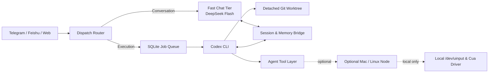

<div align="center">

# 🚂 Conveyor

**Your personal developer agent in Telegram, Feishu, and Web — running Codex in isolated git worktrees with hardware-level desktop Computer Use.**

Turn your phone into a remote dev workstation. Write code, fix CI, inspect diffs, debug servers, and control real desktop apps without cloud sandbox lock-in.

[](LICENSE)
[](https://www.python.org/downloads/)
[](#local-development--verification)
[](#quick-start)
[](#everywhere-you-work)

[中文文档](README.zh.md) · [Web Console](docs/web_console.md) · [Architecture](docs/architecture.en.md) · [Desktop Security](docs/desktop_security.md) · [Installation Guide](docs/installation.md)

</div>

---

## ⚡ What is Conveyor?

When you step away from your desk, your code, servers, logs, and development environment stay behind on your VPS or workstation. 

**Conveyor bridges that gap.** It turns a private Telegram chat, Feishu conversation, or mobile Web PWA into an auditable mission control plane for your personal developer environment:

```text
               📱 You (Phone / Tablet / Laptop)
                     │
        ┌────────────┼────────────┐
        ▼            ▼            ▼
    Telegram       Feishu      Web Console
    (Bot API)   (Card UI)       (SSE PWA)
        └────────────┬────────────┘
                     ▼
         🚂 Conveyor Control Plane (VPS / Dev Box)
         ├── ⚡ Fast Chat Tier (DeepSeek Flash, sub-second responses)
         ├── 🛠️ Codex Agent Tier (isolated Git worktrees)
         ├── 📋 Persistent FIFO Queue (survives reboots)
         └── 🖥️ Desktop Computer Use (/dev/uinput kernel virtual mouse & Cua)
```

No public multi-tenant SaaS. No ephemeral throwaway containers that lose your dependencies. **One trusted operator controlling their own machine with strict `/diff`, `/apply`, and `/cancel` safety controls.**

---

## 🎬 What It Feels Like

### 1. 📱 Fix Bugs On The Go (Worktree Isolation)
You're on the train and a CI pipeline breaks. Send a one-liner to your bot:

```text
You:     /fix tests/test_parser.py is failing with KeyError 'timestamp'
Conveyor: ⏳ Codex started job-8492 in detached worktree `wt-parser-fix`...
          ✅ Fixed: Updated models/parser.py to supply default ISO timestamp.
          Ran pytest tests/test_parser.py: 14 passed in 0.42s.
You:     /diff
Conveyor: [git diff preview shown with colorized syntax]
You:     /apply
Conveyor: 🚀 Applied changeset to main branch cleanly.
```

### 2. 🖥️ Hardware-Level Desktop Computer Use
Unlike agents that rely on synthetic window manager events or hijack your active cursor, Conveyor uses **Linux `/dev/uinput` kernel virtual devices + Multi-Pointer X (MPX)** (or macOS Cua on execution nodes) to deliver real physical mouse clicks and keyboard strokes to background apps, non-accessible WebGL/canvas areas, and native software — **without moving your physical mouse pointer**:

```text
You:     /computer_task open Chrome, navigate to localhost:3000, and click the blue canvas CTA
Conveyor: 🎯 Claimed target window: Chrome (PID 4821)
          📍 Dispatched physical click to (x=450, y=720) via /dev/uinput virtual mouse
          📸 Captured verification screenshot [id: shot_9421]
          ✅ Action succeeded: canvas state transitioned to "Active".
```

### 3. ⚡ Dual-Tier Conversational Brain
Need to brainstorm an architecture change or check server health? You don't wait for a heavy agent run. The **Fast Chat Tier (DeepSeek Flash)** streams sub-second conversational answers and server diagnostics instantly. When code needs to be written, context flows seamlessly into the **Codex Agent Tier** via a shared memory bridge:

```text
You:     Why is the VPS running so hot right now?
Conveyor: ⚡ CPU load is 4.82 (8 cores). Process `docker-build` (PID 19821) has been 
          consuming 380% CPU for 18 minutes. Memory is healthy (3.2 GB / 16 GB used).
You:     Let's kill that runaway build and restart the web worker.
Conveyor: 🛠️ Routing to execution tier with confirmation gate...
```

### 4. 🛡️ Unified Approvals & Safety Gates
Whether you are on Telegram, Feishu, or the Web Console, dangerous actions (destructive shell commands, service restarts, GitHub comments) prompt for explicit 1-tap confirmation:

```text
┌─────────────────────────────────────────────────────────────┐
│  ⚠️ Confirmation Required: Restart Service                 │
│  Target: conveyor-telegram-bot.service                      │
│  Origin: User #9812401 · Expires in 5 minutes               │
│                                                             │
│  [ ✅ Confirm Restart ]          [ ❌ Cancel Request ]       │
└─────────────────────────────────────────────────────────────┘
```

---

## 🏆 Why Conveyor? (The 4 Invariants)

Most AI developer agents run inside ephemeral, throwaway cloud sandboxes. They lose your git history, lack your local CLI tooling, and require uploading proprietary code to third-party SaaS clouds.

Conveyor is built around **Four Non-Negotiable Invariants**:

| Question | Ephemeral SaaS Agents | Conveyor Invariant |
| :--- | :--- | :--- |
| **Where did it run?** | Hidden cloud container | **Isolated Git Worktree** on your own VPS / host. Your working tree stays 100% clean until you decide to merge. |
| **What changed?** | Opaque auto-commits | **Explicit `/diff` Gate**. Read every changed line, untracked file, and size delta before anything lands. |
| **How do I stop it?** | Web dashboard cancel button | **Triple Kill Switch**. `/cancel` processes, `/discard` worktrees, and `/computer_stop` instantly halts desktop automation. |
| **What was allowed?** | Full access to whatever is in the cloud container | **Kernel-Level Policy Floor**. Blocked financial/payment actions, sandboxed environment variables, and strict sender allowlists. |

---

## 📱 Everywhere You Work

Conveyor provides a unified control plane across all your daily devices:

| Capability | Telegram Bot | Feishu / Lark | Web Console (PWA) | Mac / Linux Node |
| :--- | :---: | :---: | :---: | :---: |
| **Natural Language Coding** | ✅ (`/run`, `/fix`) | ✅ (`/run`, `/fix`) | ✅ Real-time SSE | ⚡ Execution Host |
| **Worktree `/diff` & `/apply`** | ✅ Terminal text | ✅ Interactive Cards | ✅ Visual Color Diff | ⚡ Git Worktrees |
| **Persistent FIFO Queue** | ✅ Full control | ✅ Full control | ✅ Visual Queue List | ⚡ SQLite Storage |
| **Host Diagnostics (`/load`, `/ps`)** | ✅ Instant | ✅ Instant | ✅ Live Telemetry | ⚡ Native OS |
| **Interactive Approvals** | ✅ Inline buttons | ✅ Action Cards | ✅ Modal Approval | ⚡ Cryptographic Token |
| **Computer Use (Physical Clicks)** | ✅ Cua / `/dev/uinput` | ✅ Cua / `/dev/uinput` | ✅ Screen & Stream | 🖥️ Kernel / Cua Driver |
| **Personal Notes & Reminders** | ✅ `MEMORY.md` | ✅ `MEMORY.md` | ✅ Live Editor | ⚡ Local SQLite / Markdown |
| **MCP Connectors & Skills** | ✅ Custom Tools | ✅ Custom Tools | ✅ Inspector | ⚡ Sandboxed Execution |

---

## 🧠 Dual-Tier Brain Architecture

Conveyor operates on a dual-tier cognitive architecture:

```text
┌────────────────────────────────────────────────────────────────────────┐
│                        Operator Request (Chat / Command)               │
└───────────────────────────────────┬────────────────────────────────────┘
                                    │
                                    ▼
                ┌───────────────────────────────────────┐
                │ handlers/dispatch.py (Intent Router)  │
                └───────┬───────────────────────┬───────┘
                        │                       │
      [Q&A / Ideation / Small Talk]             [Code Changes / CLI / /fix]
                        │                       │
                        ▼                       ▼
        ┌────────────────────────┐      ┌────────────────────────┐
        │  ⚡ Fast Chat Tier      │      │  🛠️ Codex Agent Tier    │
        │  (DeepSeek Flash)      │      │  (Tool Execution)      │
        └───────────┬────────────┘      └───────────┬────────────┘
                    │                               │
                    │ 1. Discussions synced         │ 2. Task summary synced
                    │    to session context         │    to chat memory
                    ▼                               ▼
       ┌─────────────────────────────────────────────────────────┐
       │             🌉 Shared Session & Memory Bridge           │
       │                                                         │
       │   • session.jsonl ◀── Chat turns injected for Codex     │
       │   • chat_memory.db ◀── Job summaries injected for Chat  │
       │   • Worktree Grounding ◀── Recent git diff/state        │
       └────────────────────────────┬────────────────────────────┘
                                    │
                                    ▼
       ┌─────────────────────────────────────────────────────────┐
       │             🖥️ Telegram / Feishu / Web Console          │
       │       Unified chronological transcript & event stream   │
       └─────────────────────────────────────────────────────────┘
```


```mermaid
flowchart LR
    User[Telegram / Feishu / Web]
    Router[Dispatch Router]
    Chat[Fast Chat Tier<br/>DeepSeek Flash]
    Queue[SQLite Job Queue]
    Codex[Codex CLI]
    WT[Detached Git Worktree]
    Bridge[Session & Memory Bridge]
    Tools[Agent Tool Layer]
    Node[Optional Mac / Linux Node]
    CUA[Local /dev/uinput & Cua Driver]

    User --> Router
    Router -->|Conversation| Chat
    Router -->|Execution| Queue
    Queue --> Codex
    Codex --> WT
    Codex --> Tools
    Chat <--> Bridge
    Codex <--> Bridge
    Tools -. optional .-> Node
    Node -. local only .-> CUA
```

---

## 🚀 5-Minute Quick Start

### Prerequisites
- A Debian/Ubuntu VPS or macOS host with Python 3.10+ and Git.
- [Codex CLI](https://github.com/openai/codex) installed and authenticated.
- A Telegram account (or Feishu / Lark developer app).

### Option A: One-Line Automated Bootstrap (Recommended for VPS)

```bash
curl -fsSL https://raw.githubusercontent.com/mammut001/Conveyor/main/scripts/bootstrap.sh | sudo bash
```

The installer configures dependencies, sets up the Python virtualenv, launches interactive onboarding for Telegram/Feishu tokens, installs hardened systemd services, runs smoke verification, and starts Conveyor.

Manage your instance anytime:
```bash
conveyor status       # Check services and queue status
conveyor logs         # Stream live logs
conveyor doctor       # Audit environment and permissions
sudo conveyor update  # Pull updates with automatic rollback on smoke failure
```

---

### Option B: Manual Setup

1. **Clone and install dependencies**:
   ```bash
   git clone https://github.com/mammut001/Conveyor.git /opt/conveyor
   cd /opt/conveyor
   python3 -m venv .venv
   .venv/bin/pip install -r requirements.txt
   ```

2. **Configure your environment**:
   ```bash
   cp .env.example .env
   chmod 600 .env
   nano .env
   ```
   *Required minimum variables:*
   ```dotenv
   TELEGRAM_BOT_TOKEN=123456789:ABCdefGHI...
   TELEGRAM_ALLOWED_USER_ID=your_telegram_user_id
   CODEX_WORKSPACE_ROOT=/path/to/your/git/repo
   OPENAI_API_KEY=sk-... # or MINIMAX_API_KEY
   ```

3. **Verify and run**:
   ```bash
   make smoke
   .venv/bin/python bot.py
   ```

---

## 🕹️ Try It Out

Once connected, send these directly to your bot:

| Intent | Command / Message | What Happens |
| :--- | :--- | :--- |
| **Fix code** | `/fix TypeError in auth_service.py:102` | Spins up an isolated worktree, edits code, runs test suite, returns diff summary. |
| **Inspect diff** | `/diff` | Displays colorized status and line diff from the active worktree. |
| **Merge change** | `/apply` | Merges the worktree changeset cleanly into your main working branch. |
| **Discard change** | `/discard` | Cleans up the worktree without touching your working directory. |
| **Server health** | `Why is the server sluggish?` | Inspects CPU, load average, disk space, and top processes; provides actionable advice. |
| **Desktop click** | `/computer_task Click the green button` | Triggers `/dev/uinput` or Cua virtual mouse click without moving your cursor. |
| **Reminders** | `Remind me in 30 minutes to review PR` | Native SQLite-backed reminder delivered back to your chat. |
| **Quick note** | `/memo Migrated staging database to Postgres 16` | Appends entry to your dated `MEMORY.md` archive. |

---

## 🛡️ Enterprise-Grade Safety Model

Conveyor runs with `danger-full-access` within isolated git worktrees so Codex can freely edit files, run linters, and execute test suites — while surrounding agent operations with strict structural boundaries:

1. **Zero Multi-Tenant Surface**: Single operator per channel. Any message from an unverified ID is dropped before reaching any LLM or command handler.
2. **Read First, Mutate Explicitly**: Status checks, diffs, and searches are free. Merging code (`/apply`), modifying production services, and sending emails require explicit confirmation.
3. **Hard-Blocked Financial Actions**: Payments, bank transfers, crypto keyrings, and system security credentials are intercepted and blocked at the driver layer (`docs/desktop_security.md`).
4. **Child Process Environment Isolation**: Secrets and provider API keys are stripped from child process environments (`CONVEYOR_CHILD_ENV_SCOPE_PROVIDER_KEYS`).
5. **Instant Emergency Stop**: `/cancel` halts running jobs; `/computer_stop` immediately terminates desktop input automation.

---

## 📚 Documentation Index

- 📖 [System Architecture & Design](docs/architecture.en.md)
- 🌐 [Web Console & Mobile PWA Guide](docs/web_console.md)
- 🖥️ [Live Screen & One-Click Takeover](docs/live_screen.md)
- 🛡️ [Desktop Security & Computer Use Contract](docs/desktop_security.md)
- 🔒 [Apply Safety & Isolation Policy](docs/apply_safety.md)
- 🔌 [Model Context Protocol (MCP) Connectors](docs/mcp.md)
- 🧠 [Skills Library & Operator Procedures](docs/skills.md)
- 🔄 [Multi-Turn Worktree Refinement](docs/multi_turn_worktree_refinement.md)
- 💬 [Dual-Tier Fast Chat Architecture](docs/chat_tier.md)
- 🛠️ [Full Installation & Systemd Deployment](docs/installation.md)
- 🇨🇳 [中文文档 (Chinese Guide)](README.zh.md)

---

## 🗺️ Roadmap & Milestones

### Current Capabilities (v0.2.0)
- [x] **Git Worktree Physical Sandbox** — Detached per-job worktrees with strict Apply Safety Policies (path allowlists, binary/symlink protection, size caps).
- [x] **Persistent Job Queue** — SQLite-backed FIFO queue with pause/resume, priority handling, and crash recovery.
- [x] **Multi-Turn Worktree Refinement** — Stable session-scoped active worktrees accumulate incremental changes across multiple prompt turns until explicit Apply or Discard.
- [x] **Multi-Channel Control Plane** — Unified behavior across Telegram, Feishu (interactive cards), and real-time Web Console.
- [x] **Dual-Tier Brain Architecture** — Sub-second conversational responses via DeepSeek Flash alongside sandboxed Codex agent execution.
- [x] **Hardware-Level Computer Use** — Linux `/dev/uinput` physical virtual mouse + Multi-Pointer X (MPX) & macOS Cua desktop agent.
- [x] **Configurable Password & Financial Policies** — Flexible login automation while maintaining a hard-blocked security floor for payments/transfers/crypto.
- [x] **Real-Time Web Console** — Low-latency SSE streaming, scoped Apply/Discard approvals, node status, and session archive/management.
- [x] **Live Screen & One-Click Takeover** — The Web Console embeds a live view of the host desktop; one click hands you the mouse and keyboard while the Agent pauses (`docs/live_screen.md`).
- [x] **Always-On Teammate Sentry** — Scheduled patrols of host load, disk, services, error logs and CI with de-duplicated alerts on every channel.
- [x] **Transactional Deployment & CI Gates** — Pre-deploy verification, atomic rollback on health failure, and 120+ unit and smoke tests.

### Upcoming Milestones
- [ ] **More Proactive Watchers** — Host, service, log and CI patrols and the `/teammate pulse` standup have shipped; still to do: scheduled GitHub PR review reminders and dependency audits.
- [ ] **Semantic Code & Commit Search** — Local vector + BM25 hybrid search over repository history and documentation.
- [ ] **Multi-Worktree Parallel Execution** — Concurrent safe worktree scheduling across distinct project branches.
- [ ] **Voice Control & Audio Processing** — Voice message transcription and hands-free intent dispatching via Telegram and Web.

---

## 🤝 Contributing & License

Contributions are welcome! Please ensure all changes pass `make smoke` before opening a pull request. See [`CONTRIBUTING.md`](CONTRIBUTING.md) for testing guidelines.

Released under the [MIT License](LICENSE).

<div align="center">

**Star ⭐ Conveyor if you believe developers should control their own agents.**

</div>
