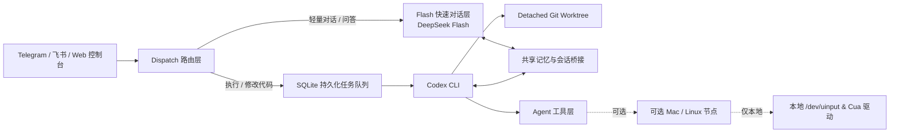

<div align="center">

# 🚂 Conveyor

**在 Telegram、飞书与 Web 控制台上随身掌控你的私人开发工作站 —— 基于 Git Worktree 物理隔离运行 Codex，搭配内核级桌面 Computer Use。**

把你的手机变成远程开发者工作站。人在路上即可写代码、修 CI、审阅 Diff、排查服务器故障，并驱动真实桌面应用，无需被云端黑盒沙箱绑架。

[](LICENSE)
[](https://www.python.org/downloads/)
[](#本地开发与验证)
[](#快速上手)
[](#随时随地多端协同)

[English](README.md) · [Web 控制台](docs/web_console.md) · [系统架构](docs/architecture.md) · [桌面安全规范](docs/desktop_security.md) · [安装部署](docs/installation.md)

</div>

---

## ⚡ 什么是 Conveyor？

当你合上笔记本离开工位时，你的代码仓库、服务、日志以及开发工具依然留在你的 VPS 或本地主机上。

**Conveyor 为你搭起这道桥梁。** 它把私密的 Telegram 聊天、飞书互动卡片或手机端 Web PWA，变成你私人开发环境的可审计指挥中心：

```text
               📱 你（手机 / 平板 / 随身设备）
                     │
        ┌────────────┼────────────┐
        ▼            ▼            ▼
    Telegram       飞书        Web 控制台
    (Bot API)   (交互卡片)      (SSE PWA)
        └────────────┬────────────┘
                     ▼
         🚂 Conveyor 控制平面 (VPS / 本地主机)
         ├── ⚡ Flash 对话快脑 (DeepSeek Flash，亚秒级极速响应)
         ├── 🛠️ Codex 执行慢脑 (基于 Git Worktree 物理隔离改代码)
         ├── 📋 持久化任务队列 (SQLite FIFO 队列，重启自愈不丢单)
         └── 🖥️ 桌面 Computer Use (/dev/uinput 内核虚拟鼠标 & Cua 驱动)
```

**这不是又一个面向公众的多租户聊天机器人。** 这里没有第三方共享工作区，也没有用完即丢、无法沉淀本地依赖的临时容器。**一位受信 Operator，带着严密的 `/diff`、`/apply`、`/discard` 与 `/cancel`，牢牢掌控属于自己的开发机器。**

---

## 🎬 核心体验场景

### 1. 📱 移动端随身修 Bug（Worktree 物理沙箱隔离）
在通勤地铁上收到 CI 报警？直接在聊天群里发一句：

```text
你:      /fix tests/test_parser.py 报错 KeyError 'timestamp'，帮忙修复并跑测试
Conveyor: ⏳ Codex 任务启动 (job-8492)，已创建独立 Worktree `wt-parser-fix`...
          ✅ 修复完成：已在 models/parser.py 中补充默认 ISO 时间戳字段。
          运行 pytest tests/test_parser.py：14 个测试全绿通过 (耗时 0.42s)。
你:      /diff
Conveyor: [返回彩色高亮 Git Diff 预览，包含变更行数与统计]
你:      /apply
Conveyor: 🚀 已安全合并回主分支 (main)，工作区状态干净。
```

### 2. 🖥️ 硬件级桌面 Computer Use（内核虚拟设备真实点击）
传统 Agent 在控制桌面时，常常发送易被 GTK 或现代浏览器直接丢弃的合成 X 事件，或者必须粗暴抢占你的鼠标指针。

Conveyor 采用 **Linux `/dev/uinput` 内核虚拟设备 + Multi-Pointer X (MPX)**（在 macOS 节点上采用 Cua 驱动），能够向后台窗口、无 Accessibility 无障碍树的 Canvas/WebGL 画布和复杂原生界面注入**真正的物理硬件级鼠标与键盘事件** —— **完全不抢占、不干扰你正在使用的物理鼠标指针**：

```text
你:      /computer_task 打开 Chrome 访问 localhost:3000，点击画布中间的提交按钮
Conveyor: 🎯 已锁定目标窗口：Google Chrome (PID 4821)
          📍 通过 /dev/uinput 虚拟鼠标向画布真实坐标 (x=450, y=720) 触发物理点击
          📸 抓取操作验证截图 [id: shot_9421]
          ✅ 点击成功生效：画布状态已切换为 "Active"。
```

### 3. ⚡ 双脑协同架构（快脑即时响应 + 慢脑深度落地）
排查线上疑难杂症或讨论技术方案时，无需忍受传统 Agent 冗长的工具调用前摇。**快脑 (DeepSeek Flash)** 亚秒级流式回答问题并即时拉取系统监控；一旦确认需要动手改代码，讨论成果通过共享记忆桥无缝注入 **Codex 执行慢脑**：

```text
你:      为什么现在服务器负载突然升高了？
Conveyor: ⚡ 当前 CPU Load 为 4.82 (8 核)。进程 `docker-build` (PID 19821) 持续占用 
          380% CPU 超过 18 分钟。内存正常 (已用 3.2 GB / 16 GB)。
你:      帮我杀掉这个失控的构建进程，然后重启 web worker 服务。
Conveyor: 🛠️ 识别到写操作需求，正在生成带确认保护的执行任务...
```

### 4. 🛡️ 统一多端审批与安全熔断
涉及高风险命令、生产服务重启或敏感操作时，无论你在 Telegram、飞书还是 Web 控制台，都会即时推送交互式审批卡片：

```text
┌─────────────────────────────────────────────────────────────┐
│  ⚠️ 高风险操作确认：重启服务                                │
│  目标：conveyor-telegram-bot.service                        │
│  发起人：User #9812401 · 5 分钟内有效                       │
│                                                             │
│  [ ✅ 确认执行 ]                  [ ❌ 取消请求 ]           │
└─────────────────────────────────────────────────────────────┘
```

---

## 🏆 为什么选择 Conveyor？（四大不可妥协的不变量）

大多数 AI 开发助手运行在云端一次性沙箱中，无法使用你本机的专用工具链与私有数据，代码甚至需要完整上传至第三方服务器。

Conveyor 坚守**四大不可妥协的工程不变量**：

| 关键问题 | 云端一次性沙箱 Agent | Conveyor 核心不变量 |
| :--- | :--- | :--- |
| **在哪里运行？** | 远端黑盒容器，跑完即焚 | **宿主机独立 Git Worktree**。主工作区永远保持干净，你的依赖、本地数据库、编译缓存全量复用。 |
| **改动了什么？** | 难以感知的自动 Commit | **强制 `/diff` 审阅门闩**。合并前清晰审查每一行改动、未跟踪文件和增量大小，杜绝污染主干。 |
| **如何紧急刹车？** | 网页点击取消，常有僵尸进程 | **三重硬核急停**。`/cancel` 杀任务进程，`/discard` 一键清除废弃分支，`/computer_stop` 秒断桌面驱动。 |
| **底线是什么？** | 取决于容器挂载权限 | **驱动级安全硬隔离**。支付、转账、密钥管理高危行为硬拦截，环境变量脱敏过滤，单 Operator 身份强校验。 |

---

## 📱 随时随地，多端协同

同一套控制平面，完美适配各种工作场景：

| 核心能力 | Telegram Bot | 飞书 / Lark | Web 控制台 (PWA) | Mac / Linux 节点 |
| :--- | :---: | :---: | :---: | :---: |
| **自然语言编程** | ✅ (`/run`, `/fix`) | ✅ (`/run`, `/fix`) | ✅ 实时 SSE 流 | ⚡ 执行宿主 |
| **Worktree `/diff` & `/apply`** | ✅ 终端格式 | ✅ 交互式富文本卡片 | ✅ 双栏对比视觉 Diff | ⚡ Git Worktree |
| **持久化任务队列** | ✅ 全指令操作 | ✅ 交互卡片控制 | ✅ 可视化队列列表 | ⚡ SQLite 存储 |
| **主机运维诊断 (`/load`, `/ps`)** | ✅ 极速回传 | ✅ 极速回传 | ✅ 实时图表遥测 | ⚡ 原生系统调用 |
| **交互式审批确认** | ✅ 内联按钮 | ✅ 飞书交互按钮 | ✅ 弹窗审批流 | ⚡ 校验加密 Token |
| **桌面 Computer Use (物理点击)** | ✅ Cua / `/dev/uinput` | ✅ Cua / `/dev/uinput` | ✅ 截屏预览与流 | 🖥️ 内核虚拟驱动 |
| **个人记忆与随手记** | ✅ `MEMORY.md` | ✅ `MEMORY.md` | ✅ 在线阅读与编辑 | ⚡ 本地 Markdown |
| **MCP 工具协议 & 技能库** | ✅ 动态加载 | ✅ 动态加载 | ✅ 可视化检查器 | ⚡ 沙箱运行环境 |

---

## 🧠 双脑系统架构与记忆模型

Conveyor 采用**“快脑（Flash 快速对话）+ 慢脑（Codex 任务执行）”**的双层大脑架构：

```text
┌────────────────────────────────────────────────────────────────────────┐
│                        用户请求 (提问 / 任务指令)                      │
└───────────────────────────────────┬────────────────────────────────────┘
                                    │
                                    ▼
                ┌───────────────────────────────────────┐
                │ handlers/dispatch.py (智能分流路由)   │
                └───────┬───────────────────────┬───────┘
                        │                       │
      [知识问答 / 方案探讨 / 闲聊]              [代码修改 / 跑命令 / 任务执行]
                        │                       │
                        ▼                       ▼
        ┌────────────────────────┐      ┌────────────────────────┐
        │  ⚡ Flash 对话 (快脑)   │      │  🛠️ Codex 执行 (慢脑)   │
        │  (DeepSeek Flash)      │      │  (Tool Execution)      │
        └───────────┬────────────┘      └───────────┬────────────┘
                    │                               │
                    │ 1. 方案探讨完成后             │ 2. 任务执行完成后
                    │    同步写入会话上下文         │    同步摘要与状态快照
                    ▼                               ▼
       ┌─────────────────────────────────────────────────────────┐
       │             🌉 共享记忆桥接 (Session Bridge)            │
       │                                                         │
       │   • session.jsonl ◀── Flash 写入讨论 (Codex 读取上下文) │
       │   • chat_memory.db ◀── Codex 写入改动摘要 (快脑随时感知) │
       │   • Worktree 状态快照 (最后一次 job 状态 / git diff 概要)│
       └────────────────────────────┬────────────────────────────┘
                                    │
                                    ▼
       ┌─────────────────────────────────────────────────────────┐
       │             🖥️ Telegram / 飞书 / Web 控制台             │
       │       TranscriptStore 统一时序呈现，两层大脑无缝衔接    │
       └─────────────────────────────────────────────────────────┘
```



---

## 🚀 5 分钟快速上手

### 运行要求
- 一台 Ubuntu / Debian VPS 或 macOS 主机（Python 3.10+，已安装 Git）。
- 已安装并已登录的 [Codex CLI](https://github.com/openai/codex)。
- 一个 Telegram 账号（或飞书开放平台应用凭证）。

### 方式 A：一键全自动安装（推荐 VPS 部署）

```bash
curl -fsSL https://raw.githubusercontent.com/mammut001/Conveyor/main/scripts/bootstrap.sh | sudo bash
```

安装脚本将自动配置系统依赖、构建 Python 隔离环境、引导交互式填写 Telegram/飞书 Token、安装经过安全加固的 systemd 系统服务、运行本地回归烟测并一键启动服务。

常用管理指令：
```bash
conveyor status       # 查看服务运行状态与队列排队情况
conveyor logs         # 实时追踪服务日志
conveyor doctor       # 自动审计系统权限与环境完整性
sudo conveyor update  # 拉取最新代码，烟测未通过自动秒级回滚
```

---

### 方式 B：手动源码部署

1. **拉取仓库并创建虚拟环境**：
   ```bash
   git clone https://github.com/mammut001/Conveyor.git /opt/conveyor
   cd /opt/conveyor
   python3 -m venv .venv
   .venv/bin/pip install -r requirements.txt
   ```

2. **配置环境变量**：
   ```bash
   cp .env.example .env
   chmod 600 .env
   nano .env
   ```
   *核心必填项：*
   ```dotenv
   TELEGRAM_BOT_TOKEN=123456789:ABCdefGHI...
   TELEGRAM_ALLOWED_USER_ID=你的Telegram数字ID
   CODEX_WORKSPACE_ROOT=/path/to/your/git/repo
   OPENAI_API_KEY=sk-... # 或配置 MINIMAX_API_KEY
   ```

3. **运行门禁烟测并启动**：
   ```bash
   make smoke
   .venv/bin/python bot.py
   ```

---

## 🕹️ 新手上手初体验（Try It Out）

连接成功后，在聊天中直接发送以下指令即可上手体验：

| 意图目标 | 示例指令 / 消息 | 背后执行的操作 |
| :--- | :--- | :--- |
| **修复代码** | `/fix TypeError in auth_service.py:102` | 自动开辟独立 Worktree，修改代码，运行单元测试并回传 Diff 摘要。 |
| **审阅改动** | `/diff` | 终端回传或卡片渲染当前工作区的彩色代码改动预览。 |
| **安全合入** | `/apply` | 检查主分支状态，确认无冲突后干净合入代码。 |
| **丢弃任务** | `/discard` | 立即销毁废弃的临时 Worktree 分支，主分支纤毫不损。 |
| **服务器体检** | `为什么服务器突然这么卡？` | 采集系统负载、内存用量、Top 耗时进程与磁盘指标，生成可操作优化建议。 |
| **桌面点击** | `/computer_task 点击网页上的绿色下载按钮` | 通过 `/dev/uinput` 虚拟设备触发真实硬件鼠标点击，丝毫不动你的操作指针。 |
| **定时提醒** | `提醒我 30 分钟后检查线上部署日志` | SQLite 持久化调度器记录提醒，到点通过当前会话准时发回。 |
| **随手速记** | `/memo 线上数据库升级至 PostgreSQL 16` | 自动归档至当天带时间戳的 `MEMORY.md` 知识库。 |

---

## 🛡️ 安全模型与工程纪律

Conveyor 允许 Codex 在隔离的 Git Worktree 内以 `danger-full-access` 权限运行，以便执行真实的代码重构、静态检查和测试集调用；但全系统围绕 Agent 构建了坚固的外围安全护城河：

1. **绝对单 Operator 原则**：严格校验发送者白名单（Telegram User ID 或飞书 Open ID），非白名单请求直接静默丢弃，绝不送入 LLM 或命令解析器。
2. **读操作畅通，写操作门闩**：查看状态、Diff 和日志排查畅通无阻；涉及合并代码 (`/apply`)、重启宿主服务或外部写入操作，必须通过带有防伪 Token 的显式确认。
3. **金融/银行底线硬件拦截**：涉及支付、转账、银行账户、数字货币钱包等关键字的操作，在驱动底层直接阻断执行（详见 `docs/desktop_security.md`）。
4. **子进程环境变量过滤**：敏感密钥和 Provider API 凭据在子进程环境中被严格剥离，防止环境变量被恶意窃取 (`CONVEYOR_CHILD_ENV_SCOPE_PROVIDER_KEYS`)。
5. **秒级应急急停机制**：随时发送 `/cancel` 强制终止代码任务，发送 `/computer_stop` 立即熔断桌面动作。

详细规范请参阅[桌面安全与执行契约](docs/desktop_security.md)与[系统架构设计说明](docs/architecture.md)。

---

## 📚 文档索引

- 📖 [系统整体架构与设计文档](docs/architecture.md)
- 🌐 [Web 控制台与手机 PWA 配置指南](docs/web_console.md)
- 🛡️ [桌面安全契约与 Computer Use 规范](docs/desktop_security.md)
- 🔒 [Apply 安全策略与工作区隔离规范](docs/apply_safety.md)
- 🔌 [Model Context Protocol (MCP) 连接器扩展](docs/mcp.md)
- 🧠 [技能库 (Skills Library) 与自定义执行规范](docs/skills.md)
- 🔄 [Worktree 多轮精修指南 (Multi-Turn Refinement)](docs/multi_turn_worktree_refinement.md)
- 💬 [双脑快聊架构设计 (Chat Tier)](docs/chat_tier.md)
- 🛠️ [完整部署与 Systemd 服务配置](docs/installation.md)
- 🇺🇸 [English Documentation](README.md)

---

## 🗺️ 路线图 (Roadmap)

### 当前已实现特性 (v0.2.0)
- [x] **Git Worktree 物理沙箱隔离** — 每个代码任务独立在 Detached Worktree 执行，具备严苛的 Apply 安全策略（路径白名单、二进制/软链接拦截、体积配额）。
- [x] **持久化单并发 FIFO 任务队列** — 基于 SQLite 的任务队列，支持暂停/恢复、重启自愈、崩溃断点保留，进程重启任务不丢。
- [x] **Worktree 交互式多轮精修** — 任务完成后保留活跃 Worktree，支持多轮增量修改对话，满意后再执行 `/apply`。
- [x] **全通道控制台矩阵** — 统一 Telegram、飞书（富文本交互卡片）与 Web 控制台的三位一体控制平面。
- [x] **双脑系统架构 (Dual-Tier Brain)** — DeepSeek Flash 极速自然对话层（<1 秒首字返回）+ Codex 深度沙箱工具执行层协同运作。
- [x] **硬件级桌面 Computer Use** — Linux `/dev/uinput` 虚拟鼠标物理点击 + X11 多指针机制 (MPX) 以及 macOS 本地 Cua 桌面驱动。
- [x] **可配置密码登录策略** — 支持常规登录密码免阻断填入，同时死守支付/转账/钱包等底线安全。
- [x] **现代化实时 Web Console** — 支持 SSE 低延迟流式传输、会话归档/一键删除、按任务绑定的 Apply/Discard 审批授权、暗黑/精简模式与无干扰排版。
- [x] **零中断事务部署与 CI 门禁** — 部署前全自动 Smoke 烟测与单元测试，健康检查失败自动回滚，120+ 测试用例保障稳定性。

### 即将推出计划 (Upcoming Milestones)
- [ ] **主动式系统与项目守护者 (Proactive Watchers)** — 自动化监控错误日志激增、定时 GitHub PR 审查提醒、依赖漏洞自动排查与每日晨报。
- [ ] **本地语义代码与提交历史检索** — 结合本地向量与 BM25 的混合语义搜索引擎，检索项目历史提交与文档知识库。
- [ ] **多工作区安全并行调度** — 支持多项目、多分支间的安全独立 Worktree 并行并发排期与锁管理。
- [ ] **语音交互与音频管线** — Telegram 与 Web 端语音输入转录，实现免动手的纯语音意图识别与任务分发。

---

## 🤝 贡献与许可协议

欢迎提交 Issue 和 Pull Request！提交前请确保本地执行 `make smoke` 全部通过。详见 [`CONTRIBUTING.md`](CONTRIBUTING.md)。

本项目采用 [MIT 许可证](LICENSE)。

<div align="center">

**如果你也认同开发者应该牢牢掌控自己的专属 Agent，欢迎为 Conveyor 点亮一颗 Star ⭐**

</div>
