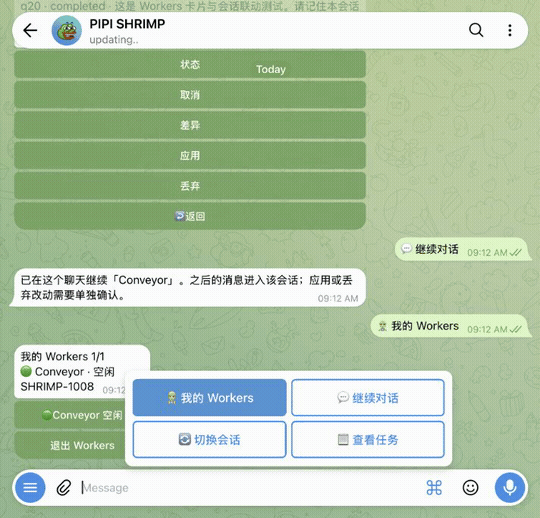

# Demo cases

English, then 中文. The walkthrough stitches three separate Telegram screenshots. Illustrative cases have no sample output.

Asset notes: [docs/assets/demos/README.md](assets/demos/README.md).

## Screenshot walkthrough / 实拍截图回放

<a href="assets/demos/telegram-workers-walkthrough.mp4"></a>

[MP4 download](assets/demos/telegram-workers-walkthrough.mp4). The GIF and MP4 stitch the three screenshots (3s, 3s, 4s; 10s). They are not a continuous recording.

| Frame | What it shows |
| :--- | :--- |
| [Workers keyboard](assets/demos/telegram-workers-menu.png) | Persistent menu from the keyboard icon: 我的 Workers, 继续对话, 切换会话, 查看任务. |
| [Workers list](assets/demos/telegram-workers-live.png) | `/workers`, then the Conveyor worker: continue, tasks, switch session, back. |
| [Screenshot routing](assets/demos/telegram-screenshot-routing.png) | `当前：Conveyor › 主会话` on the shared VPS desktop, node `vps-desktop`. |

`/start` installs the keyboard (a separate message when the welcome also has the inline onboarding button). The keyboard icon opens it again. Each operator, chat, and topic selection is isolated. Continue or switch session remembers the selected session. Browsing the list does not. With nothing selected, only a private chat uses the canonical main session (`web:web-console:agent-default`, shown as 主会话). Groups and topics do not. A screenshot follows the Agent selected now. The default main session and a default secondary session share the VPS desktop. An independent Agent uses its own X display. A missing desktop refuses the screenshot. An explicit request for an unavailable Mac is rejected.

## Weather

**Live check, 2026-10-08. Not a verified success.** Browser launch and window targeting did not complete, and no forecast was obtained. The first task, `ctsk_20261008T201226Z_d45a3015`, stopped at the 20-step cap before the browser loaded. The retry, `ctsk_20261008T201602Z_e0593fd7`, tried an explicit observe of Firefox and ApplicationFinder, then returned `target_app_not_found` and `target_app_activate_failed`. The operator stopped it at 8 completed steps. This is not a verified success demo.

Have the desktop browser already open before `/computer_task`. That is a prerequisite to try next. This check does not show that the prerequisite fixes the failure.

After an administrator has enabled Computer Use (`CONVEYOR_COMPUTER_USE_ENABLED`) and Direct mode (`CONVEYOR_COMPUTER_DIRECT_ENABLED`):

```text
/computer_arm 5
/computer_task Use the current desktop browser to check today's weather in Montreal. Read temperature and rain conditions from a weather webpage and keep it open for a screenshot. Use only browser UI, no shell/API.
```

`/computer_arm [minutes]` does not move the desktop unless those switches are already on. Check with `/computer_status` and `/computer_screenshot`. Stop with `/computer_stop`.

## Local web app check

Same gates. Browser UI only. No captured page is attached.

```text
/computer_task Open the desktop browser to the local web app already running on this machine. Confirm the page loaded and leave that tab open for a screenshot. Use only browser UI, no shell/API.
```

## Debugging, server, and worktree (illustrative)

Shapes of work, not transcripts.

- A CI or test failure goes to a Codex job in an isolated git worktree. `/diff`, then `/apply` or `/discard`. `/cancel` stops the job.
- Host questions such as load or process list stay on `/load` and `/ps`.
- Desktop clicks stay on `/computer_task` after the USE and DIRECT gates, and stop with `/computer_stop`.

---

# 演示案例

回放由三张分开的 Telegram 截图拼接。示意案例没有示例输出。

## 实拍截图回放

<a href="assets/demos/telegram-workers-walkthrough.mp4"></a>

[下载 MP4](assets/demos/telegram-workers-walkthrough.mp4)。GIF 与 MP4 把三张截图接成 10 秒（3 秒、3 秒、4 秒），不是连续录屏。

| 画面 | 内容 |
| :--- | :--- |
| [Workers 键盘](assets/demos/telegram-workers-menu.png) | 键盘图标打开常驻菜单：我的 Workers、继续对话、切换会话、查看任务。 |
| [Workers 列表](assets/demos/telegram-workers-live.png) | `/workers` 后进入 Conveyor：继续、任务、切换会话、返回。 |
| [截图路由](assets/demos/telegram-screenshot-routing.png) | `当前：Conveyor › 主会话`，VPS 共享桌面，节点 `vps-desktop`。 |

`/start` 装上键盘（欢迎语若自带内联引导按钮，键盘是另一条消息）。键盘图标可再次打开。每位操作者、每个聊天、每个话题的选择彼此隔离。继续或切换会话会记住所选会话。只浏览列表不会记住。未选择时，只有私聊使用规范主会话（`web:web-console:agent-default`，显示为「主会话」）。群和话题不会套这个默认。截图对准当前选中的 Agent。默认主会话和默认次会话共用 VPS 桌面。独立 Agent 使用自己的 X 显示。桌面缺失时拒绝截图。明确指向不可用 Mac 的请求会被拒绝。

## 天气

**2026-10-08 实机检查。不是已核验的成功演示。** 浏览器启动和窗口定位没有完成，没有取得预报。第一次任务 `ctsk_20261008T201226Z_d45a3015` 在浏览器加载前达到 20 步上限并停止。重试 `ctsk_20261008T201602Z_e0593fd7` 明确观察 Firefox 与 ApplicationFinder，随后出现 `target_app_not_found` 和 `target_app_activate_failed`。操作者在完成 8 步后停止。

建议在 `/computer_task` 之前，桌面浏览器已经打开。这是下一步可试的前提。这次检查没有证明该前提能修好这次失败。

管理员已打开 Computer Use（`CONVEYOR_COMPUTER_USE_ENABLED`）和 Direct（`CONVEYOR_COMPUTER_DIRECT_ENABLED`）之后：

```text
/computer_arm 5
/computer_task 用当前桌面浏览器查看蒙特利尔今天的天气。从天气网页读取温度和降雨情况，并保持页面打开以便截图。只用浏览器界面，不要用 shell 或 API。
```

这两个开关没开时，`/computer_arm [分钟]` 不会移动桌面。用 `/computer_status` 和 `/computer_screenshot` 查看，用 `/computer_stop` 停止。

## 本地 Web 应用检查

门闩相同，只用浏览器界面。本文不附页面截图。

```text
/computer_task Open the desktop browser to the local web app already running on this machine. Confirm the page loaded and leave that tab open for a screenshot. Use only browser UI, no shell/API.
```

## 排障、服务器与 worktree（示意）

工作形态，不是某次运行的回执。

- CI 或测试失败进入隔离 git worktree 里的 Codex 任务。先 `/diff`，再 `/apply` 或 `/discard`。`/cancel` 停任务。
- 负载、进程走 `/load` 和 `/ps`。
- 桌面点击在 USE 与 DIRECT 已开启后走 `/computer_task`，用 `/computer_stop` 停下。
