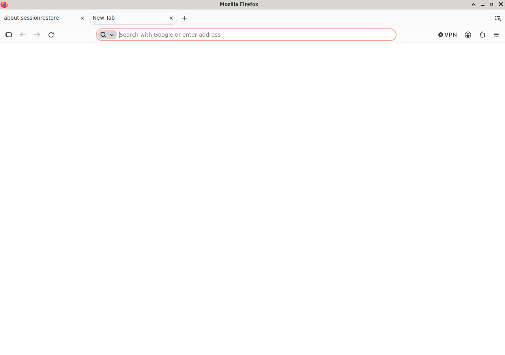
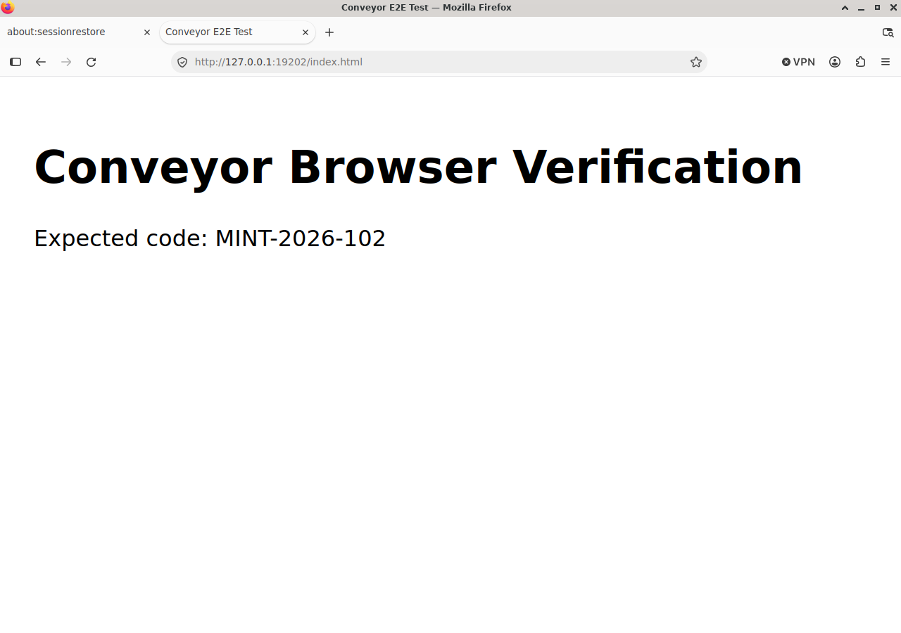
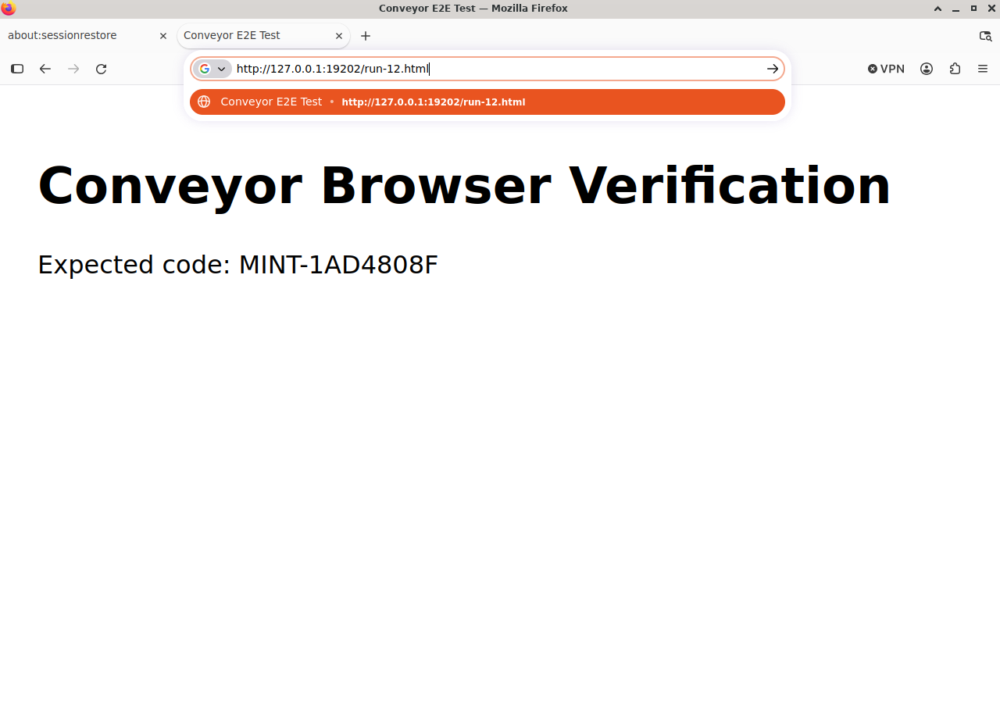
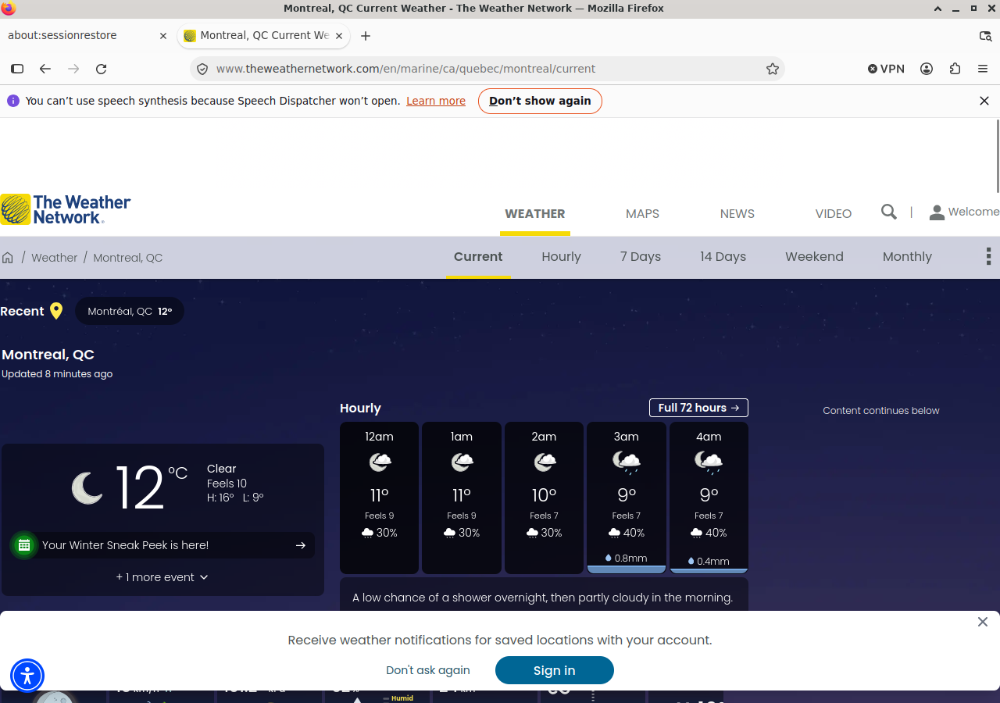

# PR #102 Linux Computer Use 实机验收

验收日期：2026-10-08（America/Montreal；日志使用 UTC 2026-10-09）。
PR：https://github.com/mammut001/Conveyor/pull/102 。保持 Draft，不合并；未修改 PR #101。

## 环境与真实性

- VPS `vps-oracle`，Ubuntu / X11，Firefox Snap（`Navigator, firefox_firefox`），Codex CLI 0.138.0，cua-driver 0.33.1。
- 独立 Xvfb `:109` 和最终验收 `:110`，1280×900，私有 Xauthority 0600；Firefox profile 按 DISPLAY 隔离。没有操纵生产浏览器。
- 测试代码在 `/tmp/conveyor-pr102-vps/source` 与最终 `/tmp/conveyor-pr102-vps-final/source`，任务、截图、空 Git workspace 和数据库均在测试根目录；未部署到 `/opt/conveyor`，未重启服务或修改生产配置。
- 实机规划模型使用生产配置的 DeepSeek Flash；真实 `CodexPlanner` + X11 backend。禁用 shell、browser/web search 和额外 computer tools，并审计调用事件。没有用 FakeBackend 或 ScriptedPlanner 冒充模型端到端结果。
- 本地页面仅监听 `127.0.0.1:19202`。20 个页面各有独立随机验证码；答案只在 workspace 外的 verifier 文件中，未进入模型目标。每轮新建任务与规划实例。
- 五种初始状态循环各四轮：关闭、已打开、最小化、Application Finder 前台、已加载其他页面。环境准备不计入 Agent 的操作步骤。
- 模型读取标签页 document title 和正文验证码；验收独立核对精确值、真实窗口身份、最终截图及工具审计。天气需要监督方逐项对照截图，`weather_needs_review` 本身不算通过。

## 根因与修复

| 根因 | 文件 | 改进 |
|---|---|---|
| Snap 包装器、profile 和 WM_CLASS 与原假设不符；Ubuntu xdotool 缺少 classname 子命令 | `desktop_linux_browser.py` | 可信固定 executable；按 DISPLAY 隔离 Snap profile；xprop 核实正常窗口、PID/class，恢复最小化窗口，验证真实前台 |
| 工具返回成功不代表焦点正确；Launcher、错误 PID 和任意应用启动可能被当作可用目标 | `desktop_cua.py`, `desktop_x11.py` | 输入前检查映射、PID/window ID、焦点和应用策略；Linux 限制浏览器启动；保留 Mac AX/Safari 路径 |
| 仅凭相同截图判定无进展，或过早接受 done | `desktop_computer_loop.py`, `desktop_computer_requests.py` | 比较动作、窗口与像素；一次不同恢复后停止；完成必须有新截图、对应浏览器及 loaded 页面状态；不保存原始窗口标题 |
| Enter 后仍读旧正文；网址输入但没提交也被当作已导航 | `desktop_computer_loop.py` | 提交后有界等待与采样；未提交的地址编辑拒绝完成；按窗口绑定状态；慢页面允许一次有界重新采样。动态网页必须等满绘制预算，且有多次同前台 loaded 新截图，不能仅因广告使全图 hash 改变而失败；加载中/错误/缺图/焦点改变仍被拒绝 |
| 长期恢复的视觉线程包含旧截图，动作轨迹缺少地址栏阶段信息 | `desktop_computer_planner.py` | 全屏模式每次规划只传当前截图、完整目标及脱敏历史；提供聚焦/等待提交状态；Mac 原有 resume 保持；错误 JSON 仅重试一次 |
| 旧 smoke 在 Linux 上假设 Mac Calculator generic launcher 可用 | `scripts/desktop_computer_smoke.py` | 显式检查 Mac 成功与 Linux 拒绝两条路径，保留原 PID/调用顺序断言 |

测试覆盖真实延迟映射、错误焦点、窗口消失、最小化、加载等待、重复动作、错误页、过早完成、错误窗口输入、接管/取消/超时、应用策略和脱敏。完整测试不读取生产任务状态作为 fixture。

## 自动化结果

- 运行时代码候选：`4016a236b365e41b21d3ad7c943e8c11f5cd2138`。
- compileall：PASS。
- Mac 本地 Python 3.9：685 tests，PASS，2 个 Linux Xvfb 测试跳过。
- VPS Python 3.10：685 tests，全部 PASS，包括真实私有 Xvfb 测试。
- Linux reliability：46 tests，PASS；Planner image：8 tests，PASS。
- 本地/VPS 完整 72 个 smoke 脚本：PASS；其中 Computer Use smoke 47/47。
- VPS smoke 使用独立 mount namespace 的临时 `/tmp`，避开原有其他用户目录，未 chown/删除宿主目录。
- Web npm ci/typecheck/lint/build/audit：PASS，0 vulnerabilities；最新运行时代码 Backend/Web GitHub CI 均 PASS：[Actions](https://github.com/mammut001/Conveyor/actions/runs/37879358821)。
- Mac 实际 GUI：NOT RUN。Mac Calculator/Safari 自动回归通过，不代表已进行物理 Mac 桌面验收。

## 实机结果与失败保留

所有批次保留在 VPS `/tmp/conveyor-pr102-vps/e2e/<run-id>/` 或最终 `/tmp/conveyor-pr102-vps-final/e2e/<run-id>/`，包括脱敏轨迹、事件类型和真实 PNG。

| 候选 / run-id | 20 轮成功率 | 本地 20 轮错误完成 | 结论 |
|---|---:|---:|---|
| `ca496ad` / `20261009T024316Z` | 70% | 4 | 标签标题/H1 混淆，另有无进展与非法 JSON；不通过 |
| `e646f8f` / `20261009T025051Z` | 60% | 6 | 未提交地址栏输入却返回旧正文；不通过 |
| `a9ba6ff` / `20261009T030119Z` | 70% | 0 | 完成检查拦住误报，但重复快捷键/未提交导致安全停止；不通过 |
| `c438e35` / `20261009T031015Z` | 100% | 0 | 20/20，平均 8.1 步 / 18.3 秒，重复无效操作 0 |
| `9cea652` / `20261009T031445Z` | 100% | 0 | 20/20，平均 8.0 步 / 13.55 秒，重复无效操作 0 |
| `4016a23` / `20261009T032724Z` | 100% | 0 | 20/20，平均 8.0 步 / 14.28 秒，重复无效操作 0 |

前期 5 轮探索测试不计入正式 20 轮结果。所有失败均保留，未通过换算或删除失败样本提高成功率。

天气旧批次监督方截图复核：`20261009T030119Z` 确实到达 Environment Canada 页面，但模型把 Friday 9 Oct 的 13°C、40% 阵雨预报称为“今天”，截图当前观测时间是 Thursday 8 Oct 11 PM EDT，当前 11.8°C / Mainly Clear。因此该天气回答判 FAIL，不能仅因为 task.status=done 就通过。

失败分类分布：ca496ad 为 4 次标题误报、1 次无进展、1 次非法 JSON；e646f8f 为 6 次旧正文误报、2 次无进展；a9ba6ff 为 3 次未提交、3 次无进展。c438e35 与 9cea652 的本地 20 轮无失败。完整 JSON 见本目录链接的 assets，未删除失败样本。

天气 `9cea652` 批次：当前 12°C、Clear、小时降雨概率 30–40% 与截图相符，但额外最高温报成 18°C，截图为 16°C，因此整体回答不接受。随后 `715d129` 的一次仅天气重试 (`20261009T032113Z`) 被 navigation_unsettled 拒绝：正文已加载，广告持续改变全图像素。这个执行层误判已在 4016a23 修复，并增加正反回归测试，未通过放宽天气数据核对来解决。

## 截图

Firefox 启动（`4016a23` 实机）：



本地网页（`4016a23` 实机，读取 MINT-2026-102）：



已修复的误报示例：地址栏仍显示“Go”候选，正文仍是旧页面，不能判完成（`e646f8f` 第 12 轮）：



## 复现

先准备私有 X server、0600 Xauthority、私有 Firefox profile，以及 localhost fixture 服务。`session.json` 和 expected.json 必须符合 `scripts/linux_browser_e2e.py` 的检查；不要连接生产 DISPLAY。参见 [host desktop](../host_desktop.md)。

```bash
python -m compileall -q desktop_linux_browser.py desktop_cua.py \
  desktop_computer_loop.py desktop_computer_planner.py desktop_computer_requests.py
python -m unittest discover -s tests -p 'test_linux_computer_reliability.py' -v
python -m unittest discover -s tests -v
make smoke PY=/opt/conveyor/.venv/bin/python
cd web && npm ci && npm run typecheck && npm run lint && npm run build
```

GUI 验收（默认 stability 20 轮，其他各一轮；不要加 `--rounds 20`，否则每种 case 都跑 20 轮）：

```bash
cd /tmp/conveyor-pr102-vps-final/source
/opt/conveyor/.venv/bin/python scripts/linux_browser_e2e.py \
  --root /tmp/conveyor-pr102-vps-final --cases startup,local,stability,weather \
  --manifest /tmp/conveyor-pr102-vps-final/session.json
```

## 接管、安全与隔离

真实 X11 后端 + 明确标注的 scripted adversarial planner：PASS。接管在规划返回旧 click 之前开启，保持 0.8 秒；期间所有 backend 调用为 0；释放后仅执行 observe，旧 click 没有执行，有新截图。使用最终运行时代码，测试桌面为 :109，不干扰 :110 的模型验收。第一次测试脚本用了非允许的 takeover reason，被正确拒绝；改为合法的 operator_requested 后通过；本报告保存最终运行时代码的重测证据。脚本错误没有被当作产品缺陷或成功样本。

复现：

```bash
python docs/testing/pr102-takeover-repro.py \
  --root /tmp/conveyor-pr102-vps --manifest /tmp/conveyor-pr102-vps/session.json
```

证据：[takeover-real.json](../assets/pr102/takeover-real.json)。自动回归另覆盖 observe/click/type/hotkey 接管拦截、取消/超时、应用策略、raw title/键盘内容脱敏及独立桌面无 host fallback。

生产复核：[production-postcheck.json](../assets/pr102/production-postcheck.json)：部署 SHA 保持 6be6b4918a63e7a66c3408424432e5d2383621ff，三个服务 active，运行中 Computer Use 任务 0，活动接管 0。桌面 TCP 仅 127.0.0.1:3389；无公开 VNC/noVNC。

## 性能与限制

最终 20 轮：20/20 成功，错误完成 0/20，平均 8.0 步、14.28 秒，浏览器启动成功率 100%，最小化/Launcher/其他页面恢复 12/12，重复无效操作计数 0。指标仅针对这批本地任务；样本不代表任意网站或模型长期可靠性。

Mac 实际 GUI 未运行；共享 host Cua 输入链路未运行完整模型验收（只读窗口探测通过）；真实 GUI 证据来自独立 Agent X11 后端。没有部署生产版本。这些边界须保留在合并审查中，不能用 Linux 单元测试替代物理 Mac 验收。

开放网页的语义质量仍受模型影响：历史回答出现了日期混淆、附加数字误读和漏项。完成检查可以拦截执行状态错误，但不能代替逐项阅读核对；不能把本地 20/20 外推为所有网页任务 100% 准确。

## 最终天气复核

4016a23 的完整批次到达真实天气页，但仅报告“低概率阵雨”，没有列出截图上的百分比；判为不完整，不接受。随后将测试任务的“precipitation”明确为原始需求的“numeric probability with forecast period”，只重跑天气，未修改运行时代码，也未改变本地 20 轮断言。

天气复测 `20261009T033528Z`：PASS（监督方逐项对照原始 PNG），11 步 / 26.296 秒，模型额外工具调用 0。Montreal, QC，12°C，Clear，Updated 8 minutes ago；12am/1am/2am 为 30%，3am/4am 为 40%，来源 The Weather Network，全部与截图一致。网页没有精确观测时间，回答没有编造。浏览器保留该页面。



自动报告仍保留 weather_needs_review，未篡改为自动 PASS。最终监督方结论单独保存在 [weather-review.json](../assets/pr102/weather-review.json)，包括之前拒绝的回答与原因。

## 最终测试矩阵

| 测试 | 结果 | 证据 |
|---|---|---|
| 单元测试 | PASS | 685；VPS 无跳过；[日志摘要](../assets/pr102/validation-summary.txt) |
| 完整 Backend CI | PASS | 上文 Actions 链接 |
| Web CI | PASS | 上文 Actions 链接；typecheck/lint/build/audit |
| Firefox 自动启动 / 聚焦 | PASS | 启动截图、真实 PID/window ID；关闭场景 4/4 |
| Application Finder 干扰 | PASS | 4/4；最终 20 轮报告 |
| 本地网页读取 | PASS | 精确 title/code；本地网页截图 |
| Montréal 天气查询 | PASS（复测） | 上述截图与监督方复核；首次漏项保留为 FAIL |
| 连续 20 次稳定性 | PASS | 20/20、0 错误完成；[完整报告](../assets/pr102/4016a23-report.json) |
| Human Takeover | PASS | 真实 X11 后端、scripted lease race，0 次接管期间调用 |
| 物理 Mac GUI / 共享 host Cua 全链路 | NOT RUN | 自动兼容回归与 Cua 只读窗口探测通过，不能冒充这些实机路径 |

[来源与源码归档校验](../assets/pr102/provenance.json)。最终运行时代码为 4016a23；之后提交仅补充天气任务说明、验收脚本和文档证据。最终 HEAD/CI 状态以 PR 页面为准。

原始失败报告：[ca496ad](../assets/pr102/ca496ad-report.json)、[e646f8f](../assets/pr102/e646f8f-report.json)、[a9ba6ff](../assets/pr102/a9ba6ff-report.json)、[c438e35](../assets/pr102/c438e35-report.json)、[9cea652](../assets/pr102/9cea652-report.json)、[715d129 天气](../assets/pr102/715d129-weather-report.json)。失败截图也保存在 assets/pr102，未删除失败记录。
